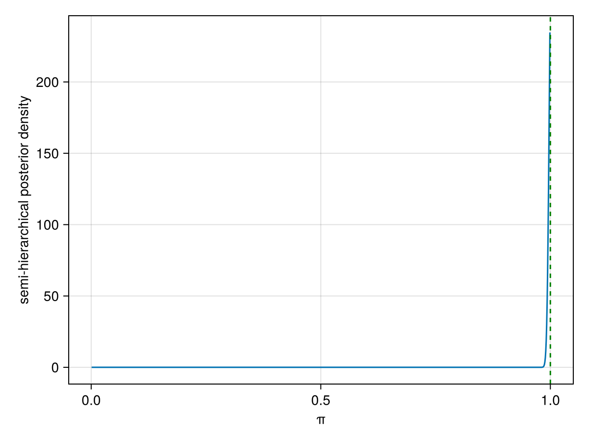
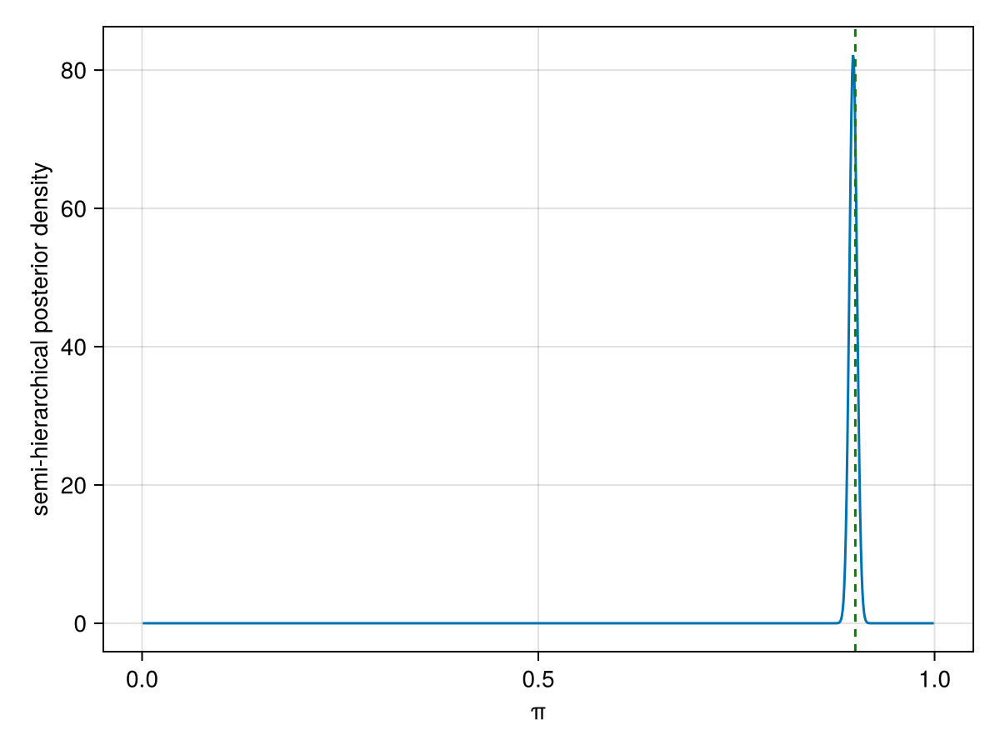
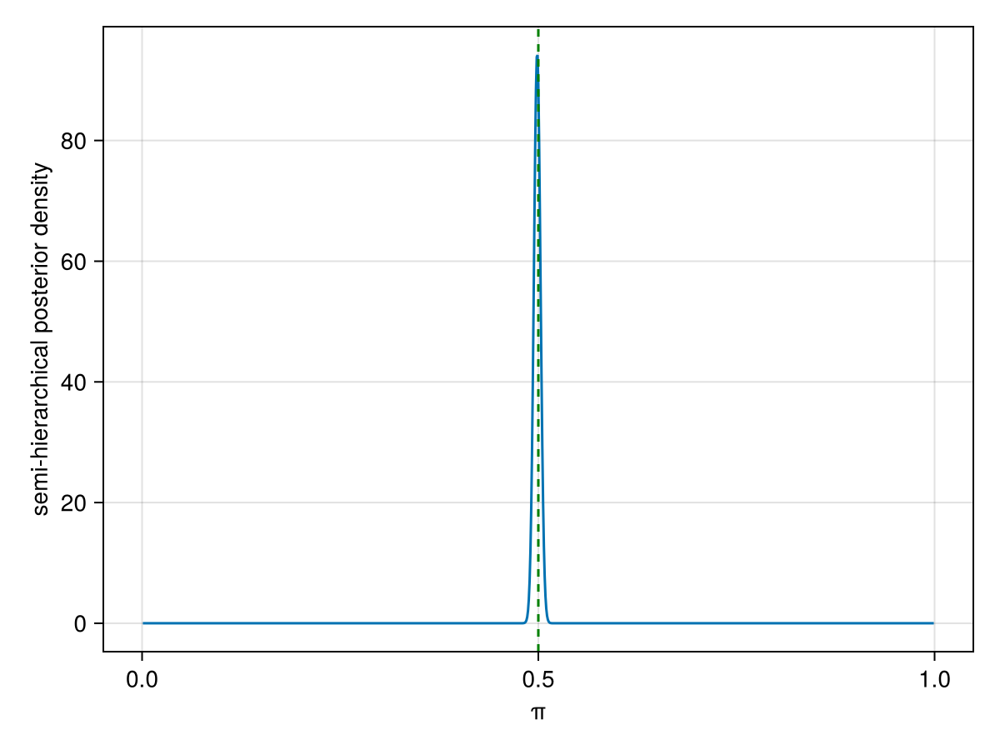
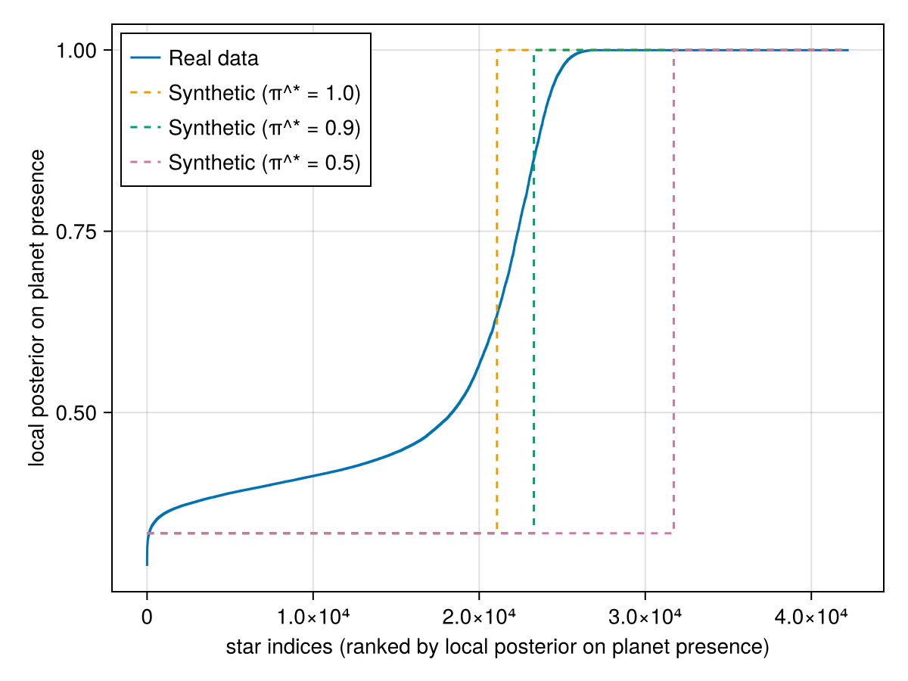
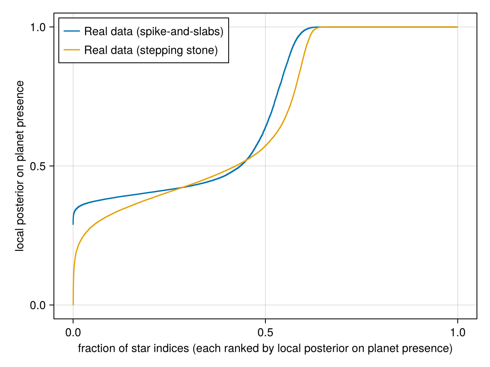
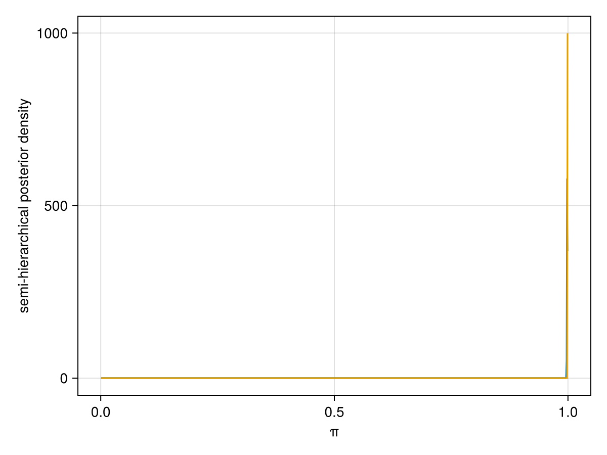
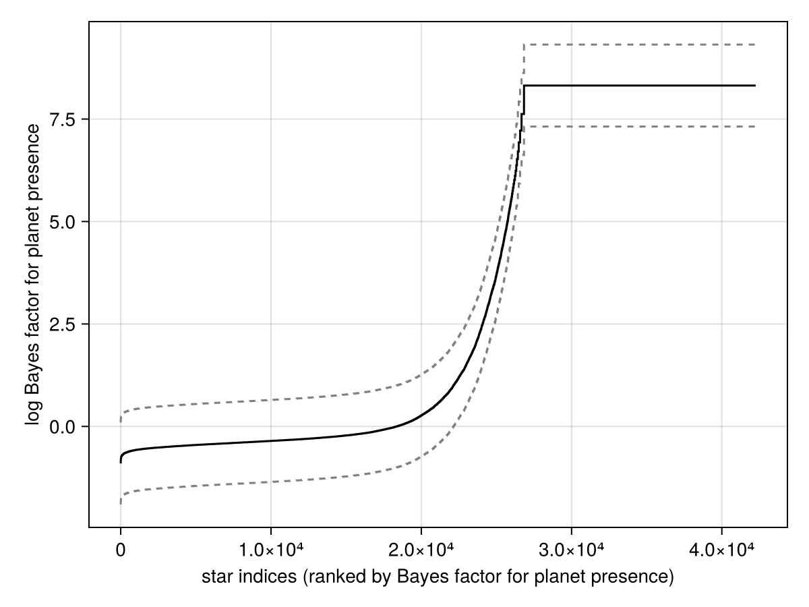
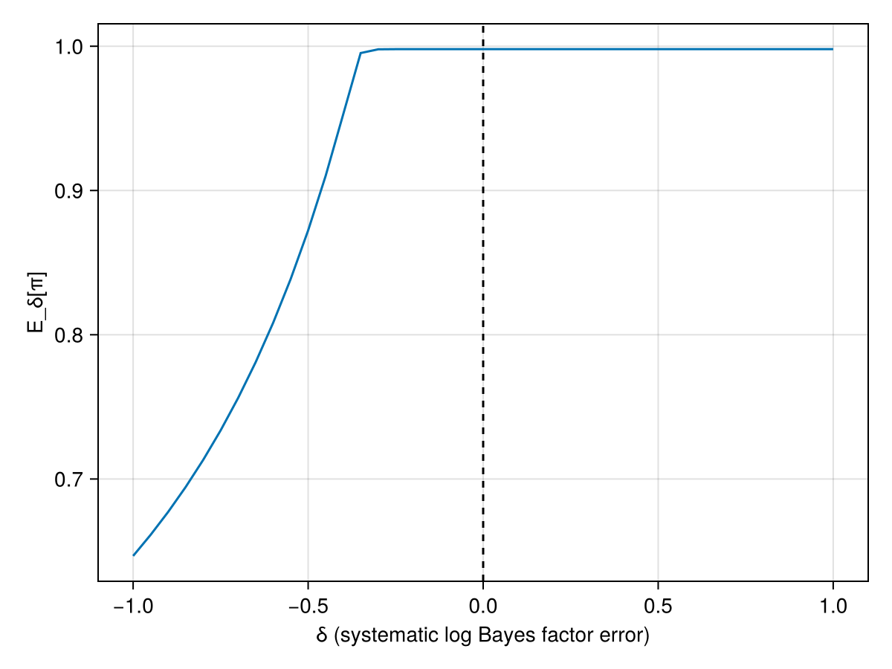



# Synthetic data 

The synthetic data is generated as follows:

1. Select a true proportion of stars $\pi^\star$ where at least one planet is truly present $x_i = 1$.
2. For each star, sample $x^*_i$ according to a Bernoulli with parameter $\pi^*$. 
3. Sample $y_i$ as follows: if $x^*_i = 0$, set $y_i = 0$; if $x^*_i = 1$ sample $y_i$ uniformly from $\{0, 1\}$. 
	
Only $y_i$ is used for inference. From these $y_i$, the Bayes factor for each star 
individually is computed (a simple calculation yields $\log \text{BF}_i = -\log 2$ if 
$y_i = 0$ and $\infty$ otherwise). 
	
Notice that in step 3, we have built the synthetic data model to mimic the fact that 
in many cases, even if a planet is truly present, it may not be possible to 
confirm its presence *when looking at a single system individually.* 
In this synthetic data, even when there is truly a planet, half of the time it will leave a data 
indistinguishable from the no-planet case. 

The key phenomenon that we want to demonstrate here is that while many stars' planet presence  
have a large uncertainty if analyzed individually, when they are pooled together 
using a hierarchical model, we can recover the true value of $\pi^*$ with high 
accuracy. 

We start with a first experiment where $\pi^\star = 1$. Using steps 1--3 above, we generate the same number 
of stars as the real dataset (42250 as of December 5), and compute the posterior distribution:

Next, we do the same with $\pi^\star = 0.9$ and $\pi^\star = 0.5$:

In all cases, the true proportion is accurately recovered (vertical dashed line). 

It is useful to probe a little bit deeper into the *apparent* paradox that 
when a single star is analyzed individually there can be large uncertainty, yet the 
hierarchical model can yield an answer with high certainty. 
Let us first clarify what we mean by "when analyzed individually." The natural 
definition is to consider a small model containing only a single binary variable $x_i$ 
with a uniform prior on $\{0, 1\}$, and a single observed variable $y_i$ with the
conditional distribution described in (3) above. Let us call the posterior on 
$x_i$ based on this small individual model, the "local posterior." This local 
posterior can be obtained from the log Bayes factor via:
$$\text{local posterior}_i = \frac{1}{1 + \exp(-\log \text{BF}_i)},$$
where 
$\log \text{BF}_i = \log(Z_i/N_i)$ denotes the log Bayes factor for planet presence 
for star $i$. The same idea applies for real data, except that the "local model" in 
that case is fairly complicated: it is a trans-dimensional Bayesian model implemented 
in the Octofitter package (@thompson_octofitter_2023) but where the prior on 
planet presence versus absence is a Bernoulli with parameter $1/2$. 

In the figure below, we visualize these local posteriors, both for the 
synthetic data (dashed lines) and real data, by sorting each set in increasing order 
of Bayes factors:

As seen in that plot, for both synthetic and real data, a large fraction of the 
local posteriors are very uncertain (close to 0.5). 
How can it be that the hierarchical model's posterior can be so sharply peaked?
To provide some reassurance that the paradox is only *apparent*, we discuss here briefly 
a well established application of this counter-intuitive behaviour: 
*randomized response*, a popular methodology in the survey literature pioneered in 
@warner_randomized_1965. *Randomized response* is technique to build a survey 
about sensitive questions in which the survey person asks each respondent to 
flip a coin (secretely), and if it is tails to reply to the sensitive question 
truthfully (e.g. a question on drug use, etc), and if not, to reply positively, regardless of the truth. 
This way if there is a data breach any individual respondent can maintain plausible 
deniability. 
At the same time, using again Bayes rule, is is possible to accurately reconstruct the population proportion of e.g., drug users. 
This is similar to our setup in the following sense: while little information can 
be gained by looking at some of the single star individually (specifically, for those 
with a local posterior close to 0.5), we can still gain accurate population-level 
information.
In summary, there is no real paradox: this is rather a situation where using 
the Bayes estimator is superior to relying on intuition and back of the envelope calculations. 

In general, if the data generation mechanism is incorrectly specified, accurate 
reconstruction will not be possible. For example, if the survey respondents are 
using a biased coin, unknowingly to the statistician, the conclusions will typically be 
invalid---*with one important exception*, discussed below.

# Real data

We estimated the local Bayes factors using two different techniques: the 
stepping stone estimator, and using a spike-and-slab prior on the planet mass. 
Both models can be shown to be mathematically equivalent, but they have different computational properties 
and according to our 
benchmarking, the latter has lower Monte Carlo error. Indeed, in the finite 
computational budget considered, there is a noticeable difference in the profile 
of local posteriors:

Yet, despite these differences, for both methods, the hierarchical posterior 
computed on each of these two Bayes factor profiles yield near-identical results: 
a sharp concentration on $\pi = 1$ as seen in that plot

One would typically expect that the results from the hierarchical model would be highly sensitive to misspecification or 
systematic error 
of the individual per-star posteriors. In many scenarios, this is the case, but 
luckily, and surprisingly, the case of a posterior sharply concentrated at a boundary 
is an exception to that rule. In that case, we obtain a kind of "surplus of evidence" 
scenario, creating a range of possible systematic errors 
where the conclusion is left roughly unchanged. 
We have some evidence that the data at hand may sit in that pocket, as described in the 
next section. 

# Robustness to systematic error and misspecification

We first describe the type of systematic error we study here. 
Consider the claim that the true posterior probability of the semi-hierarchical's $\pi$ 
parameter is sharply concentrated at one.  
The worst-case misspecification in the context of that claim is that for all stars, 
the log Bayes factors for planet presence produced by the local models, $\log \text{BF}_i$ are systematically greater than 
the true log Bayes factor. To capture this worst-case scenario, we consider perturbed 
model parameterized by a perturbation $\delta$:
$$\log \widetilde{\text{BF}}_{i,\delta} = \log \text{BF}_i + \delta.$$
We consider a range of perturbations with $\delta \in [-1, 1]$. The 
log Bayes factors $\log \text{BF}_i$ from real data are shown below (solid line) along with the 
perturbed ones 
$\log \widetilde{\text{BF}}_{i,\delta}$ for extreme values of $\delta$, i.e., for 
$\{-1, +1\}$ (dashed lines):

For each $\delta$ in the range $[-1,1]$, we then compute the hierarchical model's posterior mean on $\pi$, 
$\E_\delta[\pi]$ based on the $\delta$-perturbed local models. The results, shown below, 
demonstrate that there 
is a range of values around $\delta = 0$ where the conclusion is insensitive to 
these perturbations:

# Robustness to Monte Carlo error

See notebook `delta.jl`. In summary, the model is very robust to the level of Monte Carlo error observed in the spike-and-slab local posterior approximations.

# Robustness to subsampling and the choice of prior

See notebook `prior_sensitivity.jl`. In summary, the model is very robust to the choice of prior and subsampling (even in the order of 100s of stars).

# References

::: {#refs}
:::

